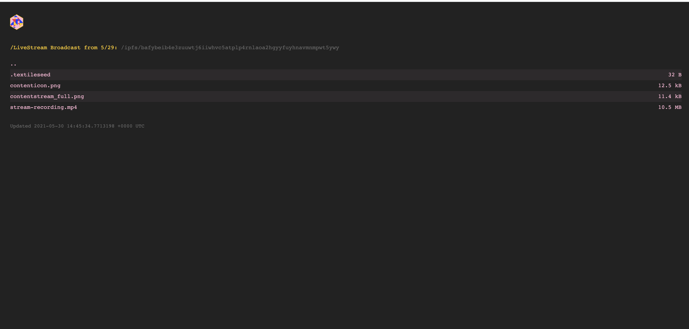

## ContentStream

ContentStream is a broadcast platform and marketplace allowing content creators to sell streams as bundles and NFT's.

## Technology

- Web3/metamask integration: Authenticate the current user for submitting and receiving payments for marketplace listings.
- Livepeer: Session and stream recording generation.
- IPFS/Textile: Preservation of stream listings/packages in separate buckets. Used as a distribution mechanism for purchased assets.
- UDT / Unlockjs: Paywalls for asset purchasing. Representation of the stream as a purchase
- The graph: Reporting and health of ecosystem. Volume indicators for using LivePeer. Indexing of contentstream transactions in the future.

## Inspiration

NFTs are exploding in popularity but a lot of the current use cases revolve around speculative artwork. Owners of NFTs often purchase them with the hope that the price will increase. Instead of being rooted in speculation, we hope to create NFT that people can connect to as well as have a piece of history from a streamer's career.

With the rise in popularity of these sorts of marketplaces, video content is starting to discover a market as well.

https://www.euronews.com/2021/05/26/sale-of-charlie-bit-my-finger-as-an-nft-could-be-the-end-of-the-2007-internet-classic

### What it does

ContentStream is a marketplace and a broadcasting platform.

Existing streamers often have large followings and may post their content to youtube or other sites after streaming of networks like Twitch (or LivePeer) - but that could be the end of it. Given these followings, we want to provide an opportunity to further connect with fans by providing memorabilia, and providing an additional revenue opportunity for the content creator. ContentStream allows any streamer to turn their streamed content into a sellable NFT and IPFS collection.

These collections can also be later resold and traded by new owners.

Many NFT marketplaces exist, but:

1. There's not a dominant one that appeals to the streaming market.
2. May not integrate with existing streaming networks. ContentStream doesn't care how you broadcast, only that the uploaded listings have a particular format and content.
3. Have higher overhead - contentstream backed by LivePeer and allows you to re-use existing assets and content if you wish.
4. Many streamers are already into technology and can port their existing streams onto the platform.
5. ContentStream is a niche platform not focused on current categories like artwork/real estate - only video content.

## Initial Monetization

ContentStream takes a small royalty fee off of transactions.

### Future Work

- Integrate ContentStream into solidity / smart contract ecosystem to have permanence on Ethereum.
- The Graph is currently used for illustrating the health and performance of the existing LivePeer network for streamer reference. We could use a smart contract and the graph to track and index the activity/trading of streaming NFT's and their users.
- Allow users to discover live content (could be LivePeer powered), though ContentStream is a marketplace initially.

### Requirements

Textile hub key
Define `REACT_APP_TEXTILE_KEY=XXX` in your environment
Define `REACT_APP_LIVEPEER_KEY=YYY` in your environment
`yarn && yarn start`

### Screenshots

Discover page

Upload and sell stream bundles

Purchase using unlock

Access purchased ipfs bundles/streams

Download

The graph index of Livepeer/streaming health

### Useful links

- https://livepeer.org/docs/installation/install-livepeer
- https://hub.docker.com/r/livepeer/go-livepeer
- https://infura.io/dashboard
- https://docs.textile.io/tutorials/hub/development-mode/
- https://docs.unlock-protocol.com/creators/locking-page

<!-->

Demo:

- Article
- Growth of streaming
- Marketplace
- Difference from other platforms
- Sell stream (textile)
- Buy stream (textile)
- Access the stream (textile)
- Create new stream (livepeer)
- View metrics / later index contentstream activity (livepeer / the graph)
-->
<!--
https://www.notion.so/Prizes-Web3-Weekend-1a3ea67b314d4c23bf8741daf8b1b69e
